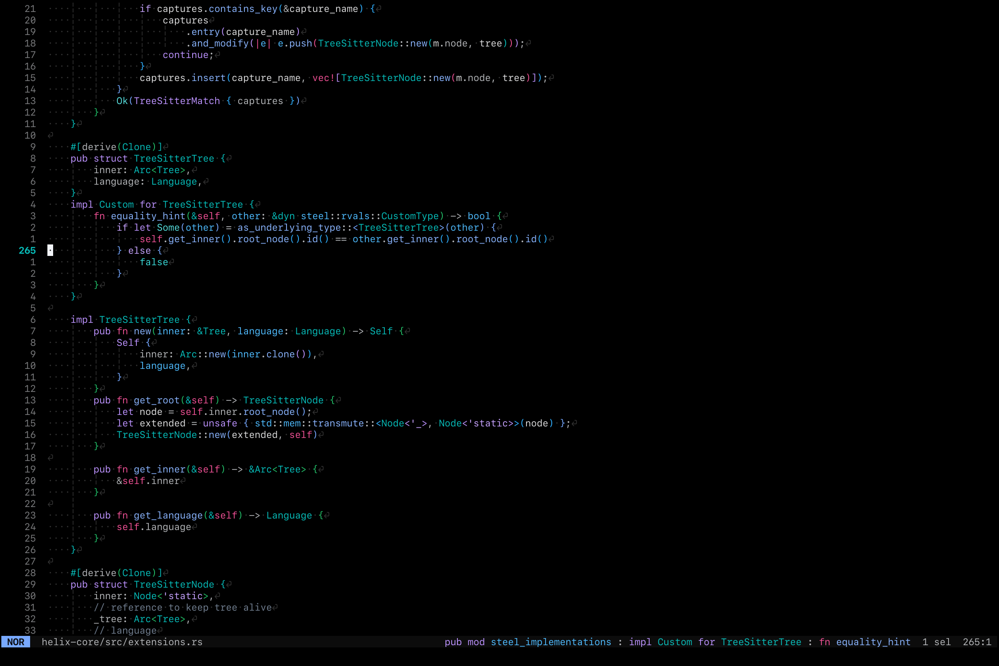

# context.hx
Helix Plugin for context

# Installation
Installing a Helix fork with plugins:
```sh
git clone https://github.com/mattwparas/helix.git -b steel-event-system
```

then build/install the helix fork with:
```sh
cargo xtask steel
```

to install the plugin with forge:
```sh
forge pkg install --git https://codeberg.org/gwid/context.hx.git
```

add the lines to your init.scm file to configure the context

```scheme
;; init.scm
(require "context/context.scm")

;; add context to the left side of the statusbar
(context-enable 'left)

```



